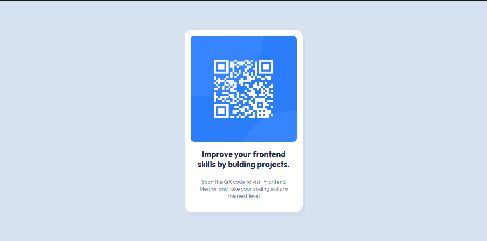

# Frontend Mentor - QR code component solution

This is a solution to the [QR code component challenge on Frontend Mentor](https://www.frontendmentor.io/challenges/qr-code-component-iux_sIO_H). Frontend Mentor challenges help you improve your coding skills by building realistic projects.

## Table of contents

- [Overview](#overview)
  - [Screenshot](#screenshot)
  - [Links](#links)
- [My process](#my-process)
  - [Built with](#built-with)
  - [What I learned](#what-i-learned)
  - [Continued development](#continued-development)
  - [Useful resources](#useful-resources)
- [Author](#author)
- [Acknowledgments](#acknowledgments)

**Note: Delete this note and update the table of contents based on what sections you keep.**

## Overview

### Screenshot



Add a screenshot of your solution. The easiest way to do this is to use Firefox to view your project, right-click the page and select "Take a Screenshot". You can choose either a full-height screenshot or a cropped one based on how long the page is. If it's very long, it might be best to crop it.

Alternatively, you can use a tool like [FireShot](https://getfireshot.com/) to take the screenshot. FireShot has a free option, so you don't need to purchase it.

Then crop/optimize/edit your image however you like, add it to your project, and update the file path in the image above.

**Note: Delete this note and the paragraphs above when you add your screenshot. If you prefer not to add a screenshot, feel free to remove this entire section.**

### Links

- Solution URL: [(https://github.com/ababaug/QR-code-component)]
- Live Site URL: [https://ababaug.github.io/QR-code-component/]

## My process

### Built with

- Semantic HTML5 markup
- CSS custom properties
- Flexbox
- [Styled Components](https://styled-components.com/) - For styles

**Note: These are just examples. Delete this note and replace the list above with your own choices**

### What I learned

I have learnt to structure and styled a website using html and css. I have learnt to use flexbox for align the contents on a web page.

To see how you can add code snippets, see below:

```html
<body>
  <main aria-label="Content page" class="container">
    <div class="qr-image">
      
    </div>
    <div class="qr-content" role="contentinfo">
      <h1>Improve your frontend skills by bulding projects.</h1>
      <p>
        Scan the QR code to visit Frontend Mentor and take your coding skills to
        the next level
      </p>
    </div>
  </main>
</body>
```

```css
@import url("https://fonts.googleapis.com/css2?family=Outfit:wght@100..900&display=swap");

* {
  box-sizing: border-box;
  padding: 0;
  margin: 0;
}

body {
  font-family: "Outfit", sans-serif;
  display: flex;
  flex-direction: column;
  justify-content: center;
  align-items: center;
  background-color: hsl(212, 45%, 89%);
  height: 100vh;
}

.container {
  display: flex;
  flex-direction: column;
  justify-content: center;
  align-items: center;
  width: 320px;
  height: 497px;
  background-color: white;
  border-radius: 20px;
  box-shadow: 5px 10px #12041407;
  align-content: center;
}

.qr-image {
  width: 288px;
  height: 288px;
}

.qr-image img {
  width: 100%;
  height: 100%;
  border-radius: 10px;
}

.qr-content {
  width: 288px;
  padding: 19px;
  text-align: center;
}

.qr-content h1 {
  font-size: 22px;
  margin-bottom: 24px;
  color: hsl(218, 44%, 22%);
}

.qr-content p {
  font-size: 15px;
  color: hsl(220, 15%, 55%);
}
```

```

```

If you want more help with writing markdown, we'd recommend checking out [The Markdown Guide](https://www.markdownguide.org/) to learn more.

**Note: Delete this note and the content within this section and replace with your own learnings.**

### Continued development

Use this section to outline areas that you want to continue focusing on in future projects. These could be concepts you're still not completely comfortable with or techniques you found useful that you want to refine and perfect.

**Note: Delete this note and the content within this section and replace with your own plans for continued development.**

### Useful resources

- [Example resource 1](https://www.example.com) - This helped me for XYZ reason. I really liked this pattern and will use it going forward.
- [Example resource 2](https://www.example.com) - This is an amazing article which helped me finally understand XYZ. I'd recommend it to anyone still learning this concept.

**Note: Delete this note and replace the list above with resources that helped you during the challenge. These could come in handy for anyone viewing your solution or for yourself when you look back on this project in the future.**

## Author

- Frontend Mentor - [@ababaug](https://www.frontendmentor.io/profile/ababaug)
-
